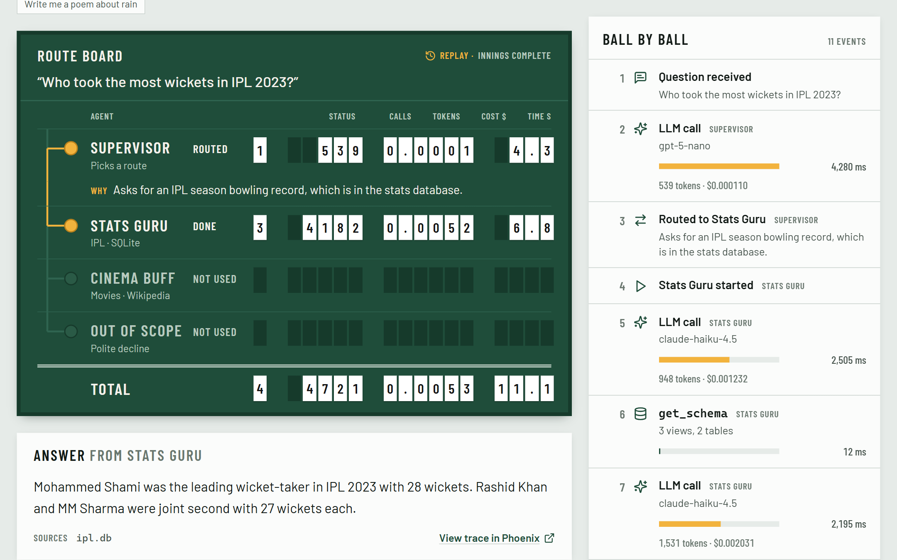
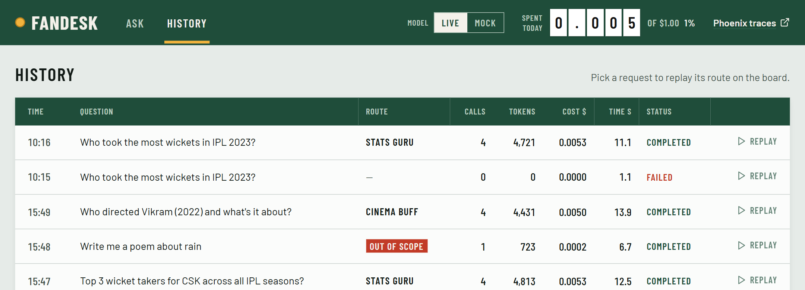
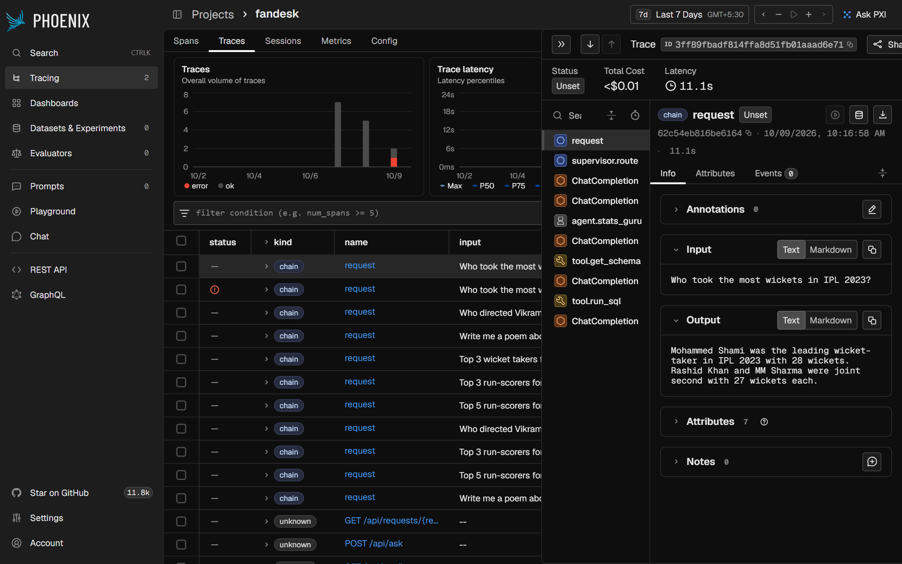
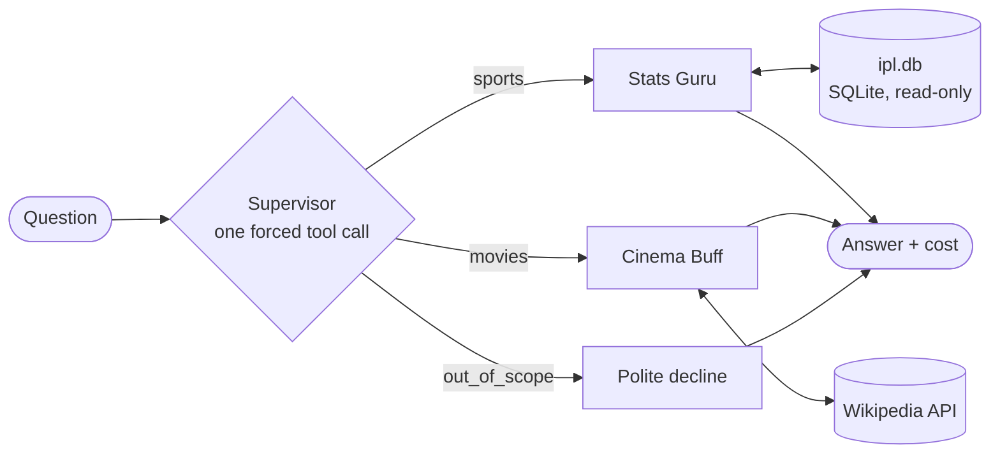
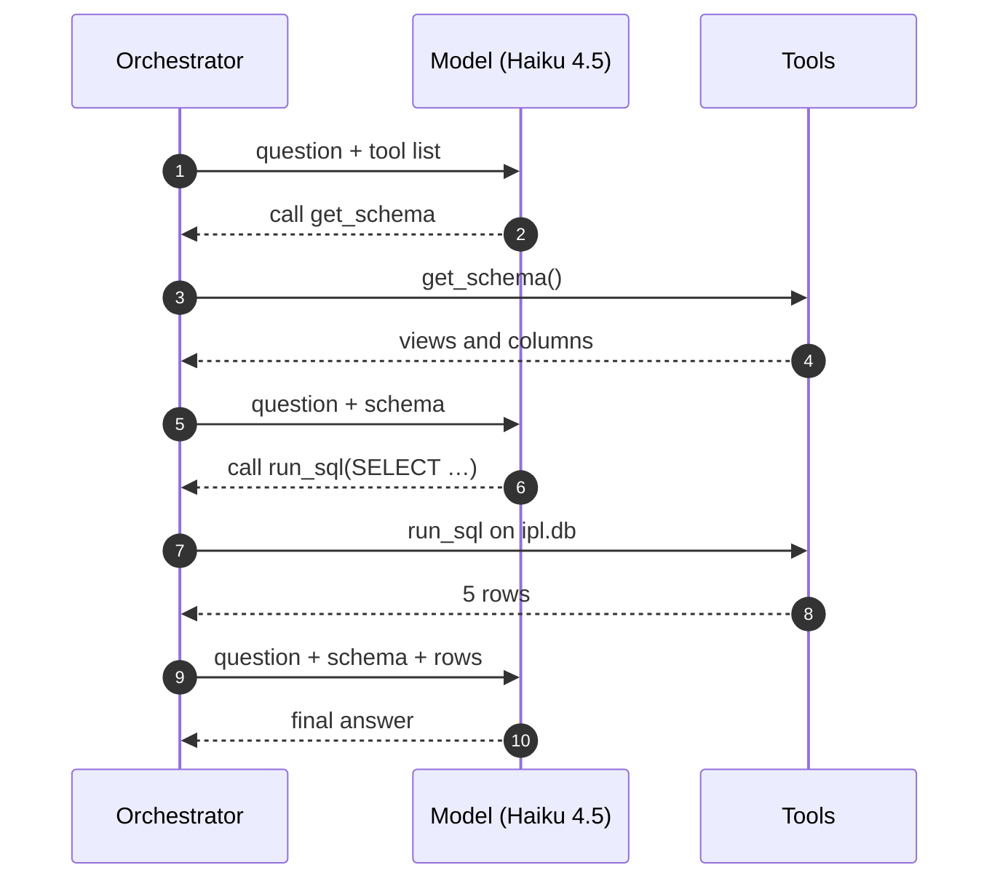

<div align="center">

# 🏏 FanDesk 🎬

**A live, watchable multi-agent AI demo, built to teach interns how agents actually work.**

Ask about IPL cricket or movies. A **supervisor** agent picks a specialist, the specialist uses real tools, and every step lights up on a cricket-style scoreboard as it happens, with the tokens, cost and time of each call.


<br>



<sub>A real run: the supervisor routed <i>“Who took the most wickets in IPL 2023?”</i> to Stats Guru, which wrote SQL against 19 seasons of ball-by-ball data. 4 LLM calls, 4,721 tokens, $0.0053.</sub>

</div>

---

## Contents

- [What interns see](#-what-interns-see)
- [The three agents](#-the-three-agents)
- [How it works](#-how-it-works)
- [Quick start](#-quick-start)
- [Live / Mock switch](#-live--mock-switch)
- [The demo script](#-the-demo-script)
- [Cost and the budget guard](#-cost-and-the-budget-guard)
- [Tracing with Phoenix](#-tracing-with-phoenix)
- [Configuration](#%EF%B8%8F-configuration)
- [Project layout](#-project-layout)
- [Development](#-development)
- [Troubleshooting](#-troubleshooting)
- [Data and credits](#-data-and-credits)

---

## 👀 What interns see

FanDesk is designed to be screen-shared in a room. Each question reveals three layers, in order:

| Layer | Where it shows | The lesson |
|---|---|---|
| **1. Routing** | The **route board**: the chosen agent's lamp lights, the rail lights up to it, and the supervisor's **WHY** appears | A supervisor is just one LLM call that picks a path and explains it |
| **2. The agent loop** | The **ball-by-ball** timeline: LLM call → tool → LLM call → tool → answer | An "agent" is a loop: the model asks for a tool, code runs it, the result goes back |
| **3. Cost** | Number plates on every row, a **TOTAL** row, and today's spend in the header | Every step has a price; you can see exactly where the money goes |

Click any total to jump to the event behind it. **History** replays any past request on the board, and every request links to its trace in **Phoenix**.

<table>
<tr>
<td width="50%"></td>
<td width="50%"></td>
</tr>
<tr>
<td align="center"><sub><b>History</b>: every request, replayable</sub></td>
<td align="center"><sub><b>Phoenix</b>: the same run as a span tree</sub></td>
</tr>
</table>

---

## 🤖 The three agents

| | **Supervisor** | **Stats Guru** | **Cinema Buff** |
|---|---|---|---|
| **Job** | Pick a route, explain why | Answer IPL questions | Answer movie questions |
| **Data** | — | Local SQLite built from [Cricsheet](https://cricsheet.org) (every IPL match, 2008 onward) | Live [Wikipedia](https://en.wikipedia.org) API |
| **Tools** | `route` (forced) | `get_schema`, `run_sql` | `search_wikipedia`, `get_page_summary` |
| **Teaching point** | Classification by task, not keywords | Reasoning over **structured** data (text-to-SQL) | Reasoning over **unstructured** text (search → read) |
| **Max LLM calls** | 1 (+1 retry) | 5 | 5 |

Anything else (*"write me a poem"*) is politely declined with a single LLM call.

**Guardrails worth pointing out in the demo:**
- **SQL:** read-only connection plus `PRAGMA query_only`, SELECT-only check, `LIMIT 50` applied by wrapping, and a hard 5-second timeout.
- **Wikipedia:** page text is passed as data, never as instructions (prompt-injection safe). Sources are cited and lookups cached for 24 hours.
- **Supervisor:** an invalid route is retried once, then declined.

---

## 🧭 How it works



There's **no agent framework**: just the OpenAI Python SDK pointed at OpenRouter, and a loop you can read in one file ([`agents/loop.py`](fandesk/backend/app/agents/loop.py)). For *"Top 5 run-scorers for CSK?"* the loop looks like this:



Each tool round trip costs one LLM call, which is why the specialist makes **3 calls** here, and the whole request **4** with the supervisor.

**Under the hood:** every step is an event (`request.received`, `supervisor.decision`, `llm.call`, `tool.call`, `tool.result`, `agent.answer`, `request.completed`). Each event is streamed to the browser over **SSE**, saved to SQLite for History, and recorded as a span in Phoenix.

```
Browser ──SSE──▶ web (nginx) ──▶ api (FastAPI) ──▶ OpenRouter   (the only paid dependency)
                                     ├──▶ ipl.db     (baked into the image)
                                     ├──▶ Wikipedia
                                     ├──▶ app.db     (requests + events)
                                     └──OTLP──▶ Phoenix
```

---

## 🚀 Quick start

**You need:** Docker, and an [OpenRouter](https://openrouter.ai) API key (optional, since Mock mode works without one).

```bash
git clone https://github.com/DheepLearningITR/DeepLearning.git fandesk
cd fandesk/fandesk
cp .env.example .env          # paste your OPENROUTER_API_KEY
docker compose up --build
```

| Open | For |
|---|---|
| **http://localhost:8090** | FanDesk |
| **http://localhost:6006** | Phoenix traces |

The first build downloads Cricsheet's IPL archive and bakes `ipl.db` into the API image. Rebuild to pick up new seasons.

---

## 🎚 Live / Mock switch

The header has a **Model: Live | Mock** switch, which you can flip mid-demo.

| | **Live** | **Mock** |
|---|---|---|
| Model calls | Real, via OpenRouter | Scripted for the six sample questions |
| SQL and Wikipedia | Real | **Still real**: answers are built from actual tool results |
| Costs money | Yes, counted against the daily budget | No, never counted |
| Use it for | The real demo | No API key, no network for the model, or a backup if live calls fail |

With no API key the switch is locked to Mock. `MOCK_LLM` in `.env` sets where it starts. Mock runs are labelled **Mock** in the answer and in History.

---

## 🎤 The demo script

The six sample-question chips double as the demo script:

| Question | Expected route | What it shows |
|---|---|---|
| Top 5 run-scorers for CSK across all IPL seasons? | Stats Guru | The full loop: schema → SQL → answer |
| Who took the most wickets in IPL 2023? | Stats Guru | Season filtering (`season_year`), bowler-only wickets |
| Who directed Vikram (2022) and what's it about? | Cinema Buff | Search → read → cite |
| Suggest movies about cricket like Lagaan | Cinema Buff | Routing by *task*, not keyword: it mentions cricket, but it's a movie question |
| Tell me about Dhoni | Ambiguous | The supervisor explains its assumption in the **WHY** |
| Write me a poem about rain | Out of scope | One LLM call, no specialist, almost no cost |

---

## 💰 Cost and the budget guard

OpenRouter reports the real cost of every call in `usage.cost`, so FanDesk needs **no price tables**: what you see is what you're billed.

| Default model | Role | Price per 1M tokens (in / out) |
|---|---|---|
| `openai/gpt-5-nano` | Supervisor | $0.05 / $0.40 |
| `anthropic/claude-haiku-4.5` | Stats Guru, Cinema Buff | $1.00 / $5.00 |

**Typical cost per question:** about **$0.005** for a stats or movie question, and about **$0.0002** when declined. A $1 daily budget covers around 200 questions.

The **budget guard** checks spend before every live LLM call and stops the request with a `budget.blocked` event if either limit would be passed:
- `DAILY_BUDGET_USD`: total live spend today
- `MAX_COST_PER_REQUEST_USD`: spend within one request

> 💡 **Tip:** if routing feels slow on screen, set `SUPERVISOR_MODEL` to a non-reasoning model such as `openai/gpt-4.1-nano` or `google/gemini-2.5-flash-lite`.

---

## 🔭 Tracing with Phoenix

Every request is one trace in [Arize Phoenix](https://phoenix.arize.com), and **the request ID is the trace ID**, so "View trace in Phoenix" opens exactly that run.

```
request                     CHAIN   route, reason, cost_usd
├── supervisor.route        CHAIN
│   └── ChatCompletion      LLM     (auto, OpenInference)
└── agent.stats_guru        AGENT
    ├── ChatCompletion      LLM
    ├── tool.get_schema     TOOL
    ├── ChatCompletion      LLM
    ├── tool.run_sql        TOOL
    └── ChatCompletion      LLM
```

LLM spans (messages, tokens, model) come from the OpenInference instrumentation for the OpenAI SDK. Agent and tool spans are created by hand. Phoenix runs as a single container on SQLite.

---

## ⚙️ Configuration

All settings live in `fandesk/.env` (copy from [`.env.example`](fandesk/.env.example)):

| Variable | Default | What it does |
|---|---|---|
| `OPENROUTER_API_KEY` | — | Your key. Without it, only Mock mode works |
| `SUPERVISOR_MODEL` | `openai/gpt-5-nano` | Routing model (must support tool calling) |
| `AGENT_MODEL` | `anthropic/claude-haiku-4.5` | Specialist model (must support tool calling) |
| `DAILY_BUDGET_USD` | `1.00` | Daily cap on live spend |
| `MAX_COST_PER_REQUEST_USD` | `0.10` | Per-request cap |
| `MOCK_LLM` | `false` | Where the Live/Mock switch starts |
| `WIKI_USER_AGENT` | `FanDesk-Demo/1.0 (…)` | Descriptive User-Agent, required by Wikimedia's API policy |
| `WEB_PORT` | `8090` | Host port for the web app |

Model IDs live only in `.env`, never in code. Any OpenRouter model with tool calling works.

---

## 🗂 Project layout

```
fandesk/
├── docker-compose.yml          web · api · phoenix
├── .env.example
├── backend/                    FastAPI · Python 3.12
│   ├── app/
│   │   ├── main.py             API endpoints + SSE stream
│   │   ├── orchestrator.py     one request, end to end
│   │   ├── llm.py              every LLM call: budget guard, cost capture, retries
│   │   ├── mock_llm.py         scripted model turns for Mock mode
│   │   ├── events.py · store.py · telemetry.py · config.py
│   │   ├── agents/             supervisor · stats_guru · cinema_buff · loop
│   │   └── tools/              sql_tools · wiki_tools
│   ├── scripts/load_ipl.py     builds ipl.db from Cricsheet
│   └── tests/                  38 tests
└── frontend/                   React 19 · Vite · Tailwind v4
    └── src/
        ├── pages/              Ask · History
        └── components/         RouteBoard · Timeline · NumberPlate · Lamp · CostStrip · …
```

Design documents at the repo root:
- [`fandesk-design.md`](fandesk-design.md): the full design spec
- [`PRODUCT.md`](PRODUCT.md): who it's for and why
- [`DESIGN.md`](DESIGN.md): the "Heritage Scoreboard" visual system

### API

| Endpoint | Purpose |
|---|---|
| `POST /api/ask` | Run a question; streams events as SSE. Body: `{"question": "...", "mock": false}` |
| `GET /api/requests` | Request history |
| `GET /api/requests/{id}` | One request with all its events (for replay) |
| `GET /api/spend` | Today's live spend vs. budget |
| `GET /api/config` | Whether live mode is available, plus model names |
| `GET /health` | Health check |

---

## 🛠 Development

**Backend** (Python 3.12+):

```bash
cd fandesk/backend
python -m venv .venv
.venv\Scripts\activate             # macOS/Linux: source .venv/bin/activate
pip install -r requirements-dev.txt
python scripts/load_ipl.py --out data/ipl.db
uvicorn app.main:app --port 8000 --reload
pytest                             # 38 tests: tools, guardrails, loader, orchestrator, API, tracing
```

**Frontend:**

```bash
cd fandesk/frontend
npm install
npm run dev                        # http://localhost:5173, proxies /api to :8000
```

To work on the UI with no backend at all, run `VITE_USE_MOCK_STREAM=true npm run dev`. That plays scripted event streams in the browser.

---

## 🩺 Troubleshooting

| Symptom | Fix |
|---|---|
| `port is already allocated` on start | Another app uses the port. Set `WEB_PORT=8091` in `.env` |
| **Live** is greyed out, "No API key" | Add `OPENROUTER_API_KEY` to `fandesk/.env` and restart the `api` container |
| "OpenRouter rejected the API key" | Check the key on [openrouter.ai/keys](https://openrouter.ai/keys) |
| "… returned no answer (provider error)" | A transient upstream failure, already retried once. Ask again, or switch model |
| "Stopped by the budget guard" | Raise `DAILY_BUDGET_USD`, or wait until tomorrow (UTC) |
| The live board doesn't animate | Something between browser and API is buffering SSE. Use the bundled nginx config |
| Git errors like `unable to append to .git/logs/HEAD` | The repo is inside OneDrive with online-only files. Clone it outside OneDrive |

---

## 📚 Data and credits

- **IPL data:** ball-by-ball data from [Cricsheet](https://cricsheet.org), made available under the [Open Data Commons Attribution License](https://opendatacommons.org/licenses/by/1-0/).
- **Movie data:** fetched live from [Wikipedia](https://en.wikipedia.org); article text is © its contributors under [CC BY-SA 4.0](https://creativecommons.org/licenses/by-sa/4.0/).
- **Models:** via [OpenRouter](https://openrouter.ai).
- **Tracing:** [Arize Phoenix](https://github.com/Arize-ai/phoenix) and [OpenInference](https://github.com/Arize-ai/openinference).
- **Type:** [Barlow and Barlow Condensed](https://fonts.google.com/specimen/Barlow) by Jeremy Tribby, self-hosted via Fontsource.

<div align="center">
<sub>Built as a teaching demo: one supervisor, two specialists, every step on the board.</sub>
</div>
